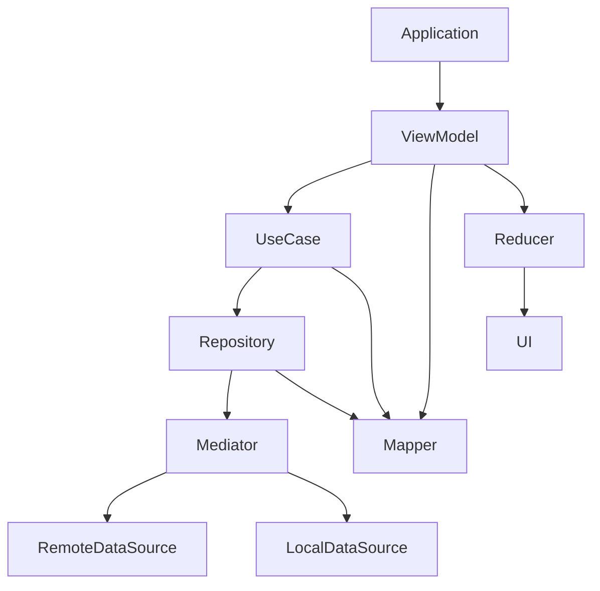

# StreamBox - DI Wiring (Hilt)

This branch introduces Hilt-based dependency injection across the app. The goal
is to remove manual wiring and global access patterns while keeping all
business logic unchanged.

## Why DI Now
As layers grow, manual construction becomes hard to maintain. DI provides a
single, declarative place to wire dependencies without coupling layers or
introducing service locators.

## What Changed
- Hilt modules added per layer and feature
- Constructor injection for ViewModels, UseCases, Repositories, Mediators, and DataSources
- Shared infrastructure provided as Singletons
- No changes to business logic, reducers, or UI behavior

## DI Structure to Start With
- `core/network/di/NetworkModule.kt`
- `data/database/src/main/kotlin/com/imandroid/streambox/data/database/di/DatabaseModule.kt`
- `features/home/data/di/HomeDataModule.kt`
- `features/home/data/di/HomeDataMapperModule.kt`
- `features/home/domain/di/HomeDomainModule.kt`
- `features/home/ui/di/HomePresentationModule.kt`

## Notes
- Repositories remain thin and declarative
- Mediator owns coordination logic
- UseCases remain unchanged
- UI continues to observe state only

## High-Level Dependency Graph
This diagram shows the conceptual dependency flow across layers.

If your Markdown renderer does not support Mermaid, use the diagram below:

